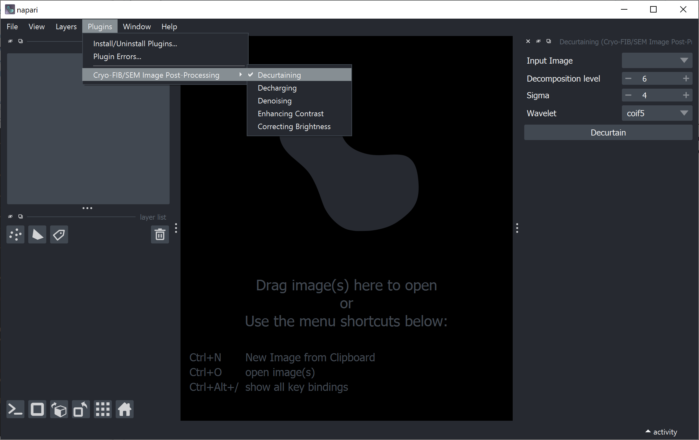

# napari-cryofibsem-imgproc

A napari plugin for artifact removal, noise reduction, contrast enhancement and stack brightness correction of Cryo-FIB/SEM image stacks.

----------------------------------

This [napari] plugin was generated with [Cookiecutter] using [@napari]'s [cookiecutter-napari-plugin] template.

<!--
Don't miss the full getting started guide to set up your new package:
https://github.com/napari/cookiecutter-napari-plugin#getting-started

and review the napari docs for plugin developers:
https://napari.org/stable/plugins/index.html
-->

## Installation

It is recommended to create a fresh [conda] environment with Python 3.12 and napari:

    conda create -n imgpro_env -c conda-forge python=3.12.0 napari pyqt

You can install `napari-cryofibsem-imgproc` via [pip]:

    pip install napari-cryofibsem-imgproc

To install latest development version :

    pip install git+https://github.com/EMCRUMC/napari-cryofibsem-imgproc.git

## Usage 
Cryo-FIB/SEM Image Processing offers 5 functions: curtaining artifact removal, charging artifact removal, noise reduction, contrast enhancement, and stack brightness correction. Using the widgets, the user can choose the input image or stack, set the function parameters, and call the function. These functions can be used in sequence with each other or individually, depending on the image processing requirements. 

## Contributing

Contributions are very welcome. Tests can be run with [tox], please ensure
the coverage at least stays the same before you submit a pull request.

## License

Distributed under the terms of the [Apache Software License 2.0] license,
"napari-cryofibsem-imgproc" is free and open source software

## Issues

If you encounter any problems, please [file an issue] along with a detailed description.

[napari]: https://github.com/napari/napari
[Cookiecutter]: https://github.com/audreyr/cookiecutter
[@napari]: https://github.com/napari
[MIT]: http://opensource.org/licenses/MIT
[BSD-3]: http://opensource.org/licenses/BSD-3-Clause
[GNU GPL v3.0]: http://www.gnu.org/licenses/gpl-3.0.txt
[GNU LGPL v3.0]: http://www.gnu.org/licenses/lgpl-3.0.txt
[Apache Software License 2.0]: http://www.apache.org/licenses/LICENSE-2.0
[Mozilla Public License 2.0]: https://www.mozilla.org/media/MPL/2.0/index.txt
[cookiecutter-napari-plugin]: https://github.com/napari/cookiecutter-napari-plugin

[file an issue]: https://github.com/EMCRUMC/napari-cryofibsem-imgproc/issues

[napari]: https://github.com/napari/napari
[tox]: https://tox.readthedocs.io/en/latest/
[pip]: https://pypi.org/project/pip/
[PyPI]: https://pypi.org/
